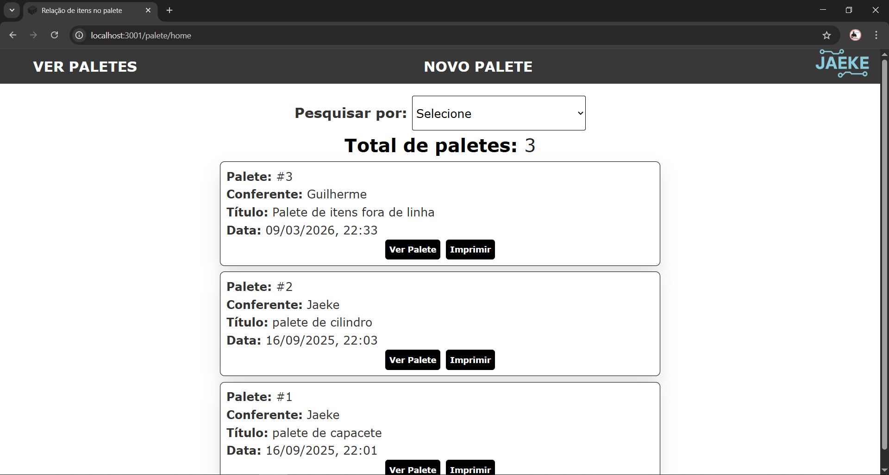
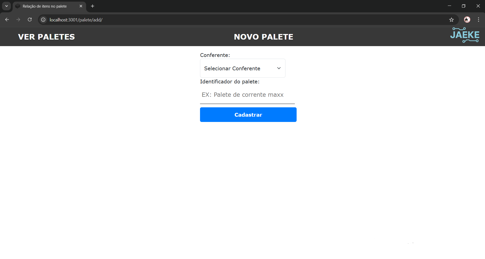
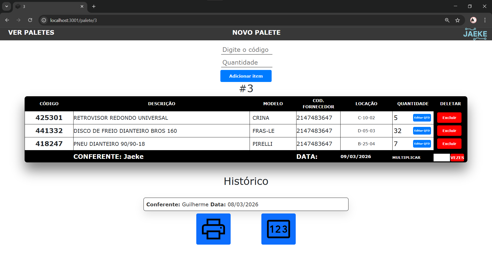
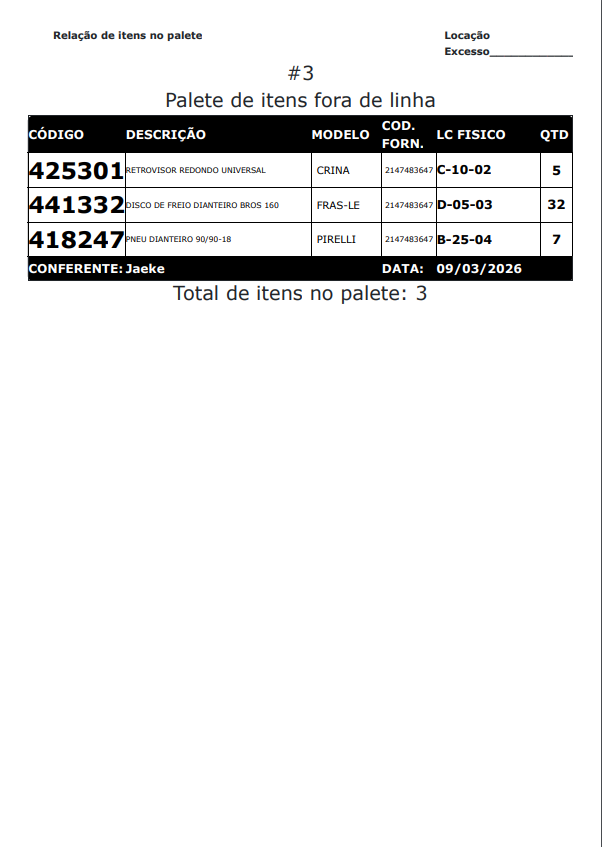
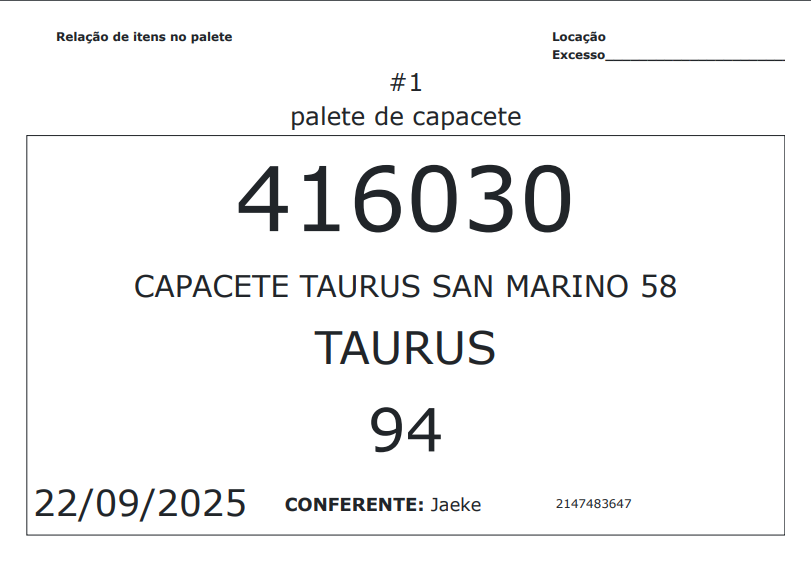

# 📦 Sistema de Gerenciamento de Paletes

Sistema web desenvolvido para gerenciamento e conferência de **paletes e itens**, permitindo criar relações entre produtos e paletes utilizados em operações logísticas.

Este foi **meu primeiro projeto que entrou em uso em ambiente de trabalho**, desenvolvido para resolver um problema real de organização e controle de produtos agrupados em paletes.

Para fins de desenvolvimento e testes, foi criada uma **simulação de banco de dados local**, permitindo trabalhar com dados semelhantes aos utilizados no ambiente real.

---

## 📸 Demonstração

### Tela inicial


### Cadastro de Palete


### Relação de itens


### Impressão de relação de itens


### Impressão de relação de palete com apenas 1 item


---

# 🚀 Tecnologias Utilizadas

* Node.js
* Express.js
* Handlebars
* MySQL
* Docker
* Docker Compose
* HTML / CSS / JavaScript

---

# 🧠 Funcionalidades

* Cadastro de **paletes**
* Associação de **itens a paletes**
* Consulta de itens no banco de dados
* Geração de **relação de produtos por palete**
* Interface web para gerenciamento
* **Impressão de etiquetas**
* Registro de logs de operações

---

# 📂 Estrutura do Projeto

```
Projeto-Relacao-Palette
│
├── controllers
│   └── paleteController.js
│
├── models
│   ├── palete.js
│   ├── item.js
│   ├── itemPalete.js
│   ├── conferente.js
│   └── log.js
│
├── routes
│   └── paleteRoutes.js
│
├── bd
│   └── conn.js
│
├── utils
│   ├── buscarItens.js
│   └── data.js
│
├── views
│   ├── home.handlebars
│   ├── add.handlebars
│   ├── addpalete.handlebars
│   ├── print.handlebars
│   └── layouts
│
├── public
│   ├── css
│   └── img
│
├── Dockerfile
├── docker-compose.yaml
└── index.js
```

---

# ⚙️ Como Executar o Projeto

## 1️⃣ Clonar o repositório

```
git clone https://github.com/seuusuario/projeto-gerenciamento-paletes.git
```

---

## 2️⃣ Instalar dependências

```
npm install
```

---

## 3️⃣ Configurar variáveis de ambiente

Crie um arquivo `.env`.

Exemplo:

```
DB_HOST=localhost
DB_USER=root
DB_PASSWORD=senha
DB_NAME=paletes
```

---

## 4️⃣ Criar banco de dados

Utilize o script SQL incluído no projeto para criar as tabelas necessárias.

---

## 5️⃣ Executar o sistema

```
npm start
```

ou

```
node index.js
```

---

# 🐳 Executar com Docker

O projeto possui suporte a containerização com Docker.

```
docker-compose up --build
```

---

# 🖨️ Impressão de Etiquetas

O sistema possui suporte à geração de arquivos de impressão para etiquetas de paletes, que podem ser enviados diretamente para impressoras térmicas compatíveis.

---

# 📈 Aprendizados

Durante o desenvolvimento deste projeto foram aplicados conceitos como:

* Estruturação de aplicações **Node.js com padrão MVC**
* Integração com banco de dados
* Manipulação de dados logísticos
* Geração de arquivos de impressão
* Containerização com **Docker**

---

# 👨‍💻 Autor

Desenvolvido por **Gui Jaeke**

Projeto utilizado como solução prática para organização e controle de produtos agrupados em paletes.
